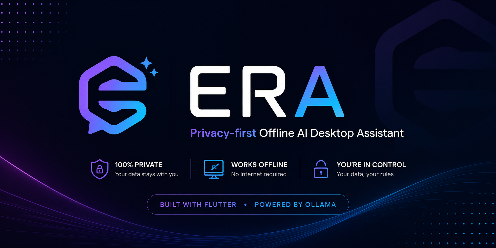
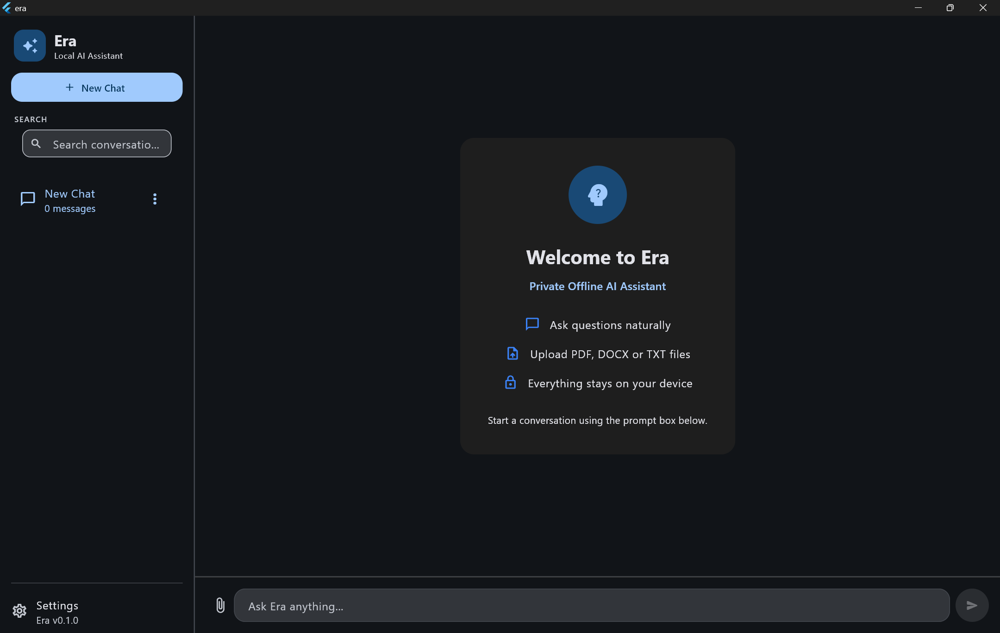
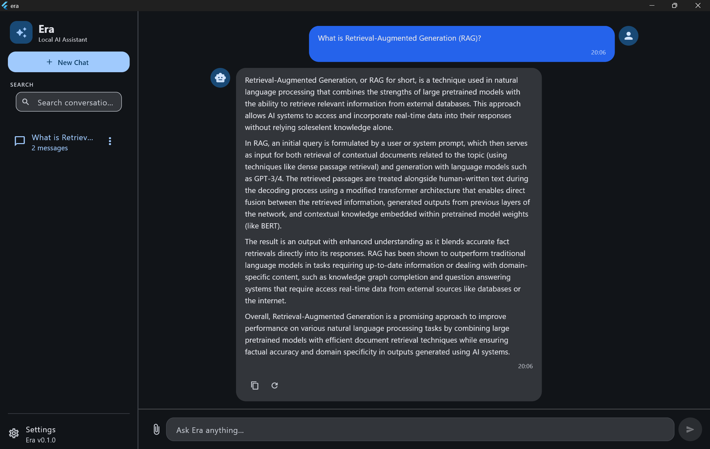
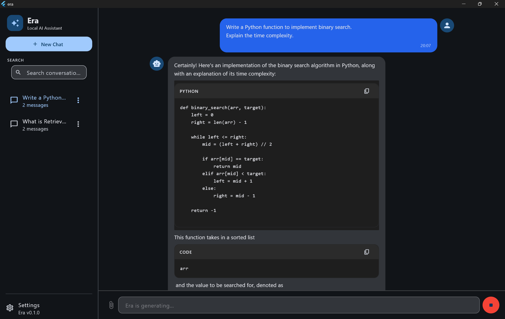
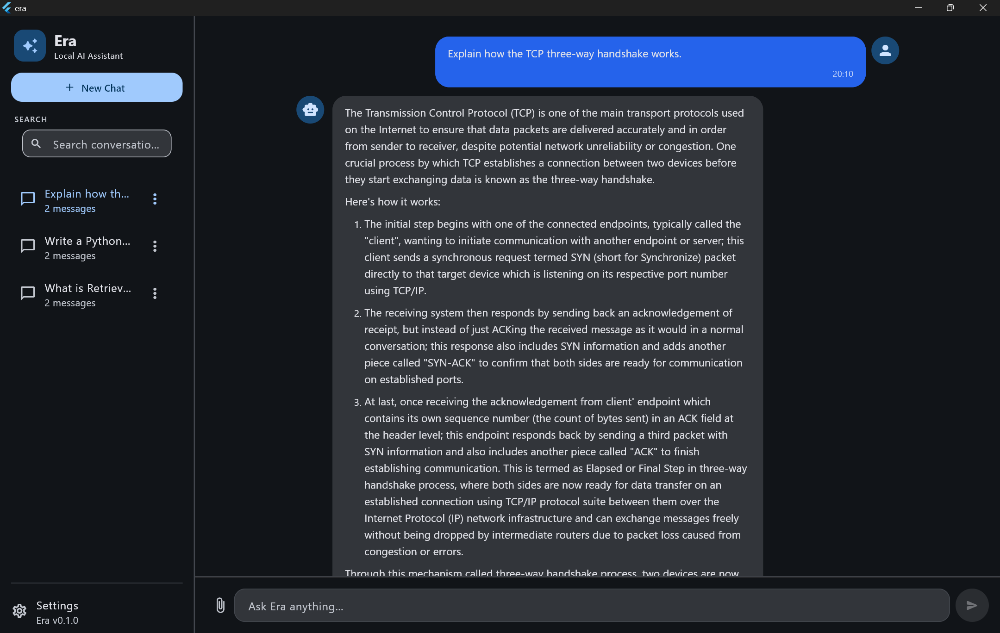
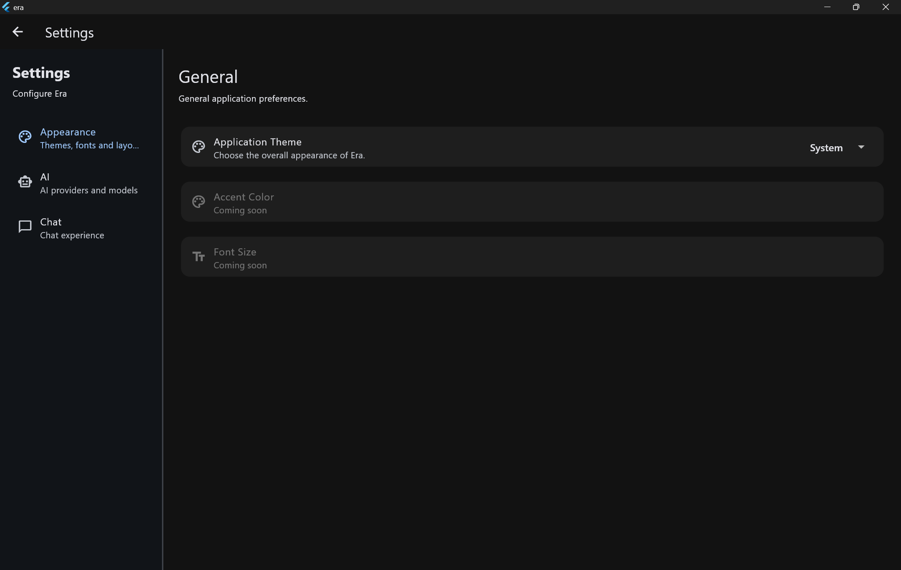
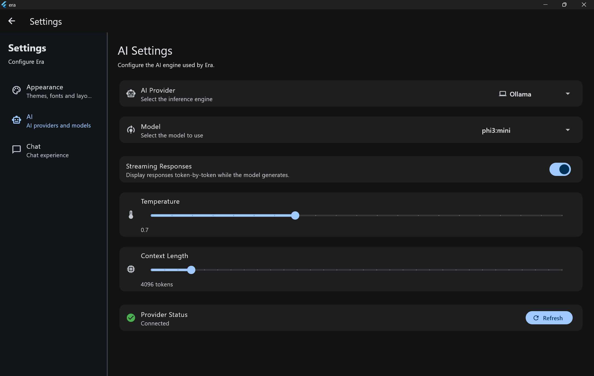
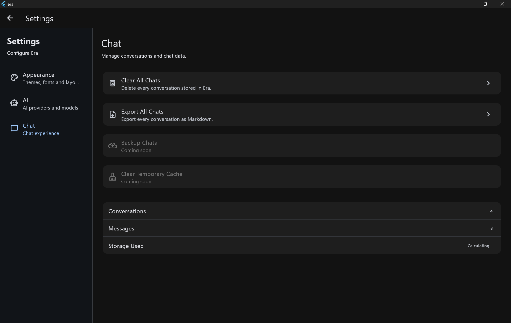

<p align="center">
  
</p>


<h1 align="center">Era</h1>

<p align="center">
Privacy-first Offline AI Desktop Assistant
</p>

<p align="center">
Built with Flutter • Powered by Ollama
</p>

<p align="center">


</p>

## Highlights

- 🔒 Privacy-first
- 💻 Runs completely offline
- 🧠 Powered by Ollama
- 🪟 Windows desktop application
- 📄 Document support
- 📚 RAG foundation
- 🏗 Modular architecture

---

## Table of Contents

- [About Era](#about-era)
- [Screenshots](#screenshots)
- [Why Era?](#why-era)
- [Current Features](#current-features)
- [Project Structure](#project-structure)
- [Technology Stack](#technology-stack)
- [Installation](#installation)
- [Project Status](#project-status)
- [Roadmap](#roadmap)
- [Contributing](#contributing)
- [Acknowledgements](#acknowledgements)
- [License](#license)


## About Era

Era is a privacy-first desktop AI assistant designed to run completely offline using local language models through Ollama.

Instead of relying on cloud APIs, Era keeps conversations, documents, and future AI capabilities on the user's own machine.

The project began as a personal learning journey to explore Flutter desktop development and local AI. Over time, it evolved into a modular application focused on privacy, extensibility, and offline productivity.

While Era is still under active development, the goal is much bigger than building another chatbot. The vision is to create an offline AI workspace capable of assisting with programming, learning, writing, document understanding, and everyday productivity while ensuring that user data never has to leave the device.

## Screenshots

### Welcome



---

### Chat



---

### Programming



---


### Markdown Rendering



---

### Settings



---
### Settings



---
### Settings



# Why Era?

Modern AI assistants are incredibly powerful, but most of them rely on cloud services where conversations and data are processed remotely. While this approach is convenient, it isn't always the right choice for users who value privacy, offline accessibility, or full control over their data.

Era was created to explore a different approach.

The idea is simple:

- Run AI completely offline.
- Keep conversations on the user's device.
- Build a modular architecture that can grow over time.
- Learn modern software engineering while building something useful.

Instead of focusing only on adding features quickly, Era focuses on building a solid foundation that can support long-term development.

---

| Feature | Status |
|---------|--------|
| Offline Chat | ✅ |
| Streaming Responses | ✅ |
| Chat History | ✅ |
| Memory Foundation | ✅ |
| Document Support | ✅ |
| RAG Foundation | ✅ |
| AI Tools | 🚧 |
| Voice | 📅 Planned |
| Multi-model | 🚧 |

---

# Current Features

### AI Chat

- Offline AI chat using Ollama
- Streaming responses
- Multiple local model support
- Markdown response rendering
- Chat history management

### Memory (Foundation)

- Local memory storage
- Basic memory extraction
- Memory management architecture

### Documents

- Document attachment
- Text extraction
- PDF support
- Foundation for document understanding

### Retrieval-Augmented Generation (RAG)

- Document chunking
- Vector storage
- Retrieval pipeline
- Embedding abstraction
- Modular RAG architecture

### Desktop Experience

- Native Flutter desktop application
- Dark theme
- Conversation sidebar
- Message actions
- Local data persistence

---

# Project Structure

```text
lib/
│
├── core/
│   ├── ai/
│   ├── theme/
│   └── utilities/
│
├── features/
│   ├── chat/
│   ├── memory/
│   ├── documents/
│   ├── rag/
│   └── settings/
│
└── main.dart
```

The project follows a feature-first architecture to keep related code together and make future expansion easier. The goal is to keep business logic, UI, repositories, and services separated so new features can be added without affecting the rest of the application.

---

# Technology Stack

| Technology | Purpose |
|------------|---------|
| Flutter | Desktop application |
| Dart | Programming language |
| Ollama | Local AI model runtime |
| Provider | State management |
| SharedPreferences | Local storage |
| Syncfusion PDF | PDF text extraction |
| Markdown | Rich response rendering |

---

# Installation

## Prerequisites

- Flutter SDK
- Dart SDK
- Ollama
- Windows desktop support enabled

Clone the repository:

```bash
git clone https://github.com/ganeshlondhe1012/era.git
```

Move into the project:

```bash
cd era
```

Install dependencies:

```bash
flutter pub get
```

Start Ollama:

```bash
ollama serve
```

Download a model:

```bash
ollama pull phi3:mini
```

Run the application:

```bash
flutter run -d windows
```

---

# Project Status

🚧 **Era is under active development.**

The current release focuses on building a reliable foundation for an offline AI assistant.

At this stage, the application already provides a functional local AI chat experience, while several advanced systems are still evolving.

The primary goal is to improve the quality of the architecture before rapidly adding new features.

Code quality, documentation, and project organization are continuously being improved as the project grows.

---

## Current Limitations

Era is still an early-stage project.

Some areas are intentionally simple and will improve over time:

- Memory retrieval is rule-based.
- RAG is still being refined.
- AI tools are not implemented yet.
- Windows is the primary supported platform.
- Code quality is continuously being refactored as the project evolves.

---

# Roadmap

The vision for Era extends far beyond a simple chat application.

### Chat

- Better prompt engineering
- Conversation summaries
- Message editing
- Improved Markdown rendering

### Memory

- Semantic memory retrieval
- Memory ranking
- Automatic memory management
- Editable memories

### Documents

- Better PDF extraction
- DOCX support
- Smarter document indexing
- Improved Retrieval-Augmented Generation (RAG)

### AI

- Multiple provider support
- Tool calling
- Better context management
- Response validation
- Model management

### Long-Term Vision

- Local AI workspace
- AI Agents
- Voice interaction
- Vision models
- Plugin system
- Workspace management

A more detailed roadmap is available in **ROADMAP.md**.

---

# Contributing

Contributions, ideas, feature requests, and bug reports are always welcome.

If you'd like to contribute, please read **CONTRIBUTING.md** before opening an Issue or Pull Request.

Every contribution, no matter how small, helps improve Era.

---

# Acknowledgements

Era is primarily a personal learning project.

Although I developed the application myself, I also relied on many excellent learning resources throughout the journey, including:

- Flutter Documentation
- Dart Documentation
- Ollama Documentation
- Open-source projects
- Technical blogs and articles
- ChatGPT for learning, brainstorming, debugging, and architectural guidance

These resources helped me better understand software architecture, Flutter desktop development, and local AI while building Era.

---

# License

This project is licensed under the **MIT License**.

See the **LICENSE** file for more information.

---

# About the Project

Era is more than just another AI chat application.

It represents my journey of learning Flutter desktop development, software architecture, and offline AI systems through building a real-world project.

I'm still learning, and many parts of the application will continue to evolve over time. Rather than waiting until everything is perfect, I chose to make the project public so others can follow its progress, share ideas, and contribute if they wish.

The current codebase is not the final destination—it's the foundation for what I hope will become a capable, privacy-first offline AI workspace.

If you have suggestions, ideas, or feedback, I'd genuinely love to hear them.

Thank you for checking out Era.
---

Made with ❤️ using Flutter, Dart and Ollama.

If you find Era interesting, consider giving the repository a ⭐.